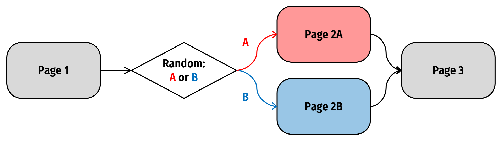

```{r setup, child="../setup.Rmd"}
```

---

```{r child="topics/0.Rmd"}
```

---

```{r child="topics/1.Rmd"}
```

---

class: center, middle

# Conditional Question Display

---

class: center

## [Conditional question display](https://surveydown.org/docs/conditional-logic#conditional-question-display)

<center>

</center>

---

## Conditional question display

Define both _conditional_ and _target_ questions in `survey.qmd`

.leftcol70[.code70[

```{r}
#| eval: false

# Conditional question
sd_question(
  type  = "mc",
  id    = "penguins",
  label = "Which is your favorite type of penguin?",
  option = c(
    "Adélie"    = "adelie",
    "Chinstrap" = "chinstrap",
    "Gentoo"    = "gentoo",
    "Other"     = "other"
  )
)

# Target question
sd_question(
  type  = "text",
  id    = "penguins_other", 
  label = "Please specify the other penguin type:"
)
```

]]

---

## Conditional question display

Define condition with `sd_show_if` in `app.R`

```{r}
#| eval: false

server <- function(input, output, session) {

  sd_show_if( #<<
    input$penguins == "other" ~ "penguins_other" #<<
  ) #<<

  # ...other server code...

}
```

--

1) The structure of the condition is always:

```{r}
#| eval: false

<condition> ~ "target_question_id"
```

--

2) Note the use of `input$penguins`

---

class: center, middle

# Conditional Page Display

---

background-color: #fff
class: center

## Example: Randomly display one of two page versions

<br>

<center>

</center>

---

First, define all pages in your `survey.qmd` file:

.leftcol[

````{markdown}
::: {.sd_page id=page1}

This is page 1

```{r}
sd_next()
```

:::

::: {.sd_page id=page2a}

This is page 2A

```{r}
sd_next()
```

:::

````

]

.rightcol[

````{markdown}
::: {.sd_page id=page2b}

This is page 2B

```{r}
sd_next()
```

:::

::: {.sd_page id=page3}

This is page 3

```{r}
sd_close()
```

:::
````

]

---

.leftcol[

In `app.R`:

```{r}
#| eval: false

server <- function(input, output, session) {

  # Generate random condition
  rand_val <- sample(c('A', 'B'), 1)

  # Store the condition value
  sd_store_value(rand_val)

  # Use sd_show_if to show target pages
  sd_show_if(
    rand_val == 'A' ~ 'page2a',
    rand_val == 'B' ~ 'page2b'
  )

  sd_server()

}
```

]

.rightcol[


]


---

```{r child="topics/2.Rmd"}
```

---

class: center, middle

# Example: **Participant screen out**

---

class: center

### Example: **Participant screen out**

<br>

<center>

</center>

---

.leftcol60[

In `survey.qmd`: Target screenout question 

```{r}
#| eval: false

sd_question(
  type  = 'mc',
  id    = 'vehicle_ownership',
  label = "Do you own a vehicle?",
  option = c(
    'Yes' = 'yes',
    'No'  = 'no'
  )
)
```

In `app.R`:

```{r}
#| eval: false

server <- function(input, output, session) {

  sd_skip_forward( #<<
    input$vehicle_ownership == "no" ~ "screenout" #<<
  ) #<<

  # ...other server code...

}
```

]

.rightcol40[

Target screenout page

````{markdown}
::: {.sd_page id=screenout}

Sorry, but you are not qualified to take our survey.

:::
````

]

---

class: center, middle

## For both conditional display and conditional skip forward,<br>there are lots of [conditions to choose from](https://surveydown.org/docs/conditional-logic#common-conditions)

---

class: inverse

```{r, echo=FALSE}
countdown(
  minutes   = 15,
  top       = 0,
  right     = 0,
  font_size = '2em'
)
```

## Your turn

- Open the survey you were editing from your last practice.
- Add conditional logic content:
    - Add one simple multiple choice question about your survey topic and another that will only display depending on a specific choice in the first question.
    - Add a target page that respondents should be sent to based on their choices in another question in an earlier page (e.g., a multiple choice question).
