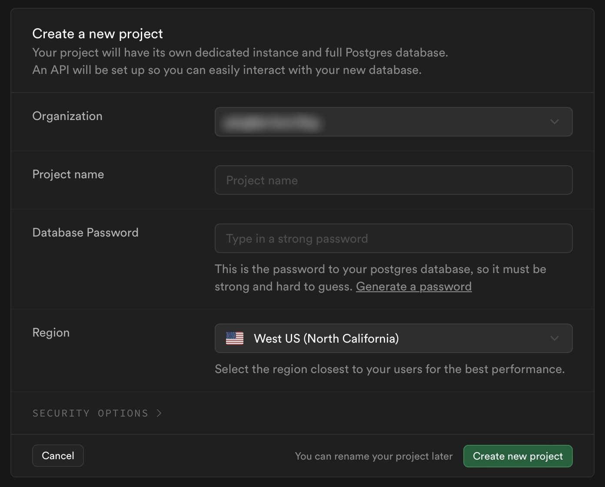
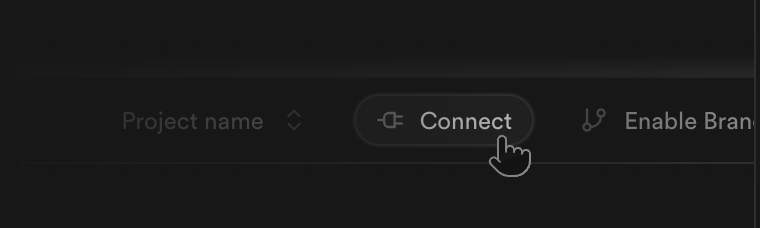
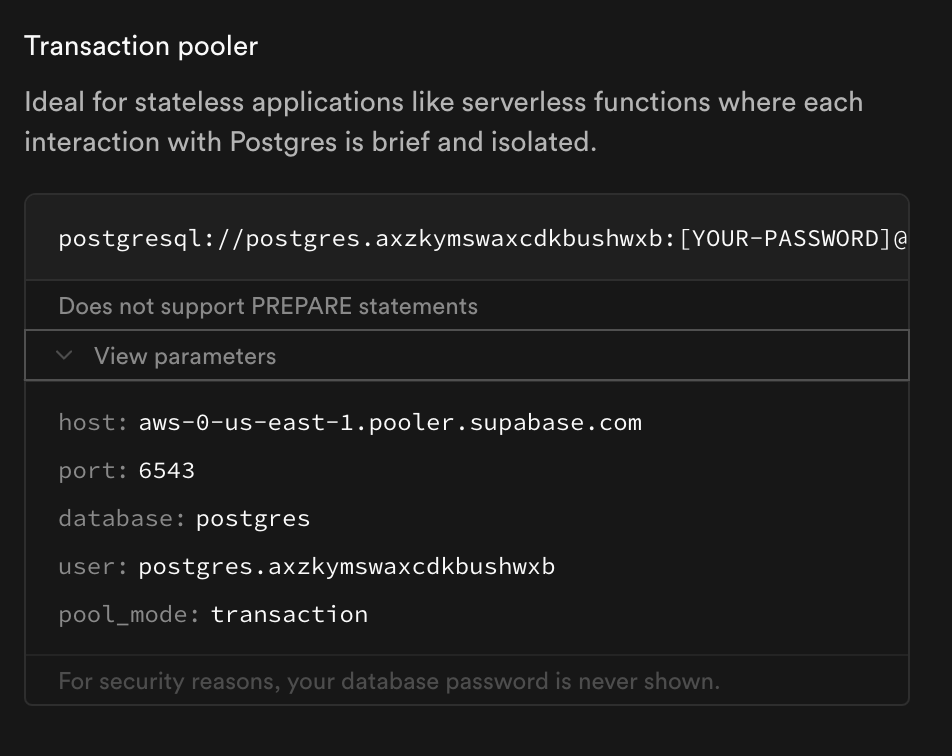
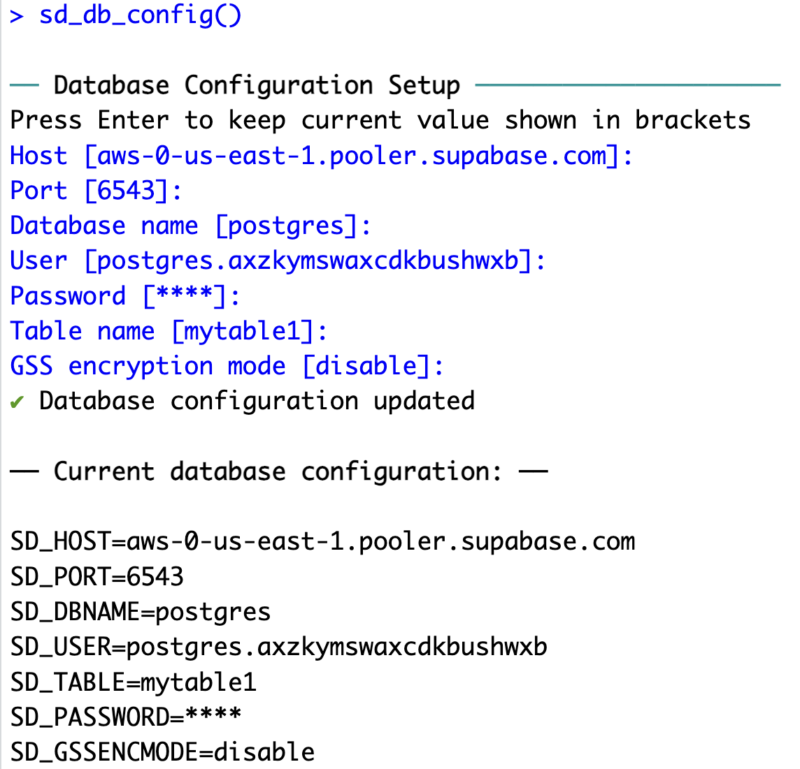
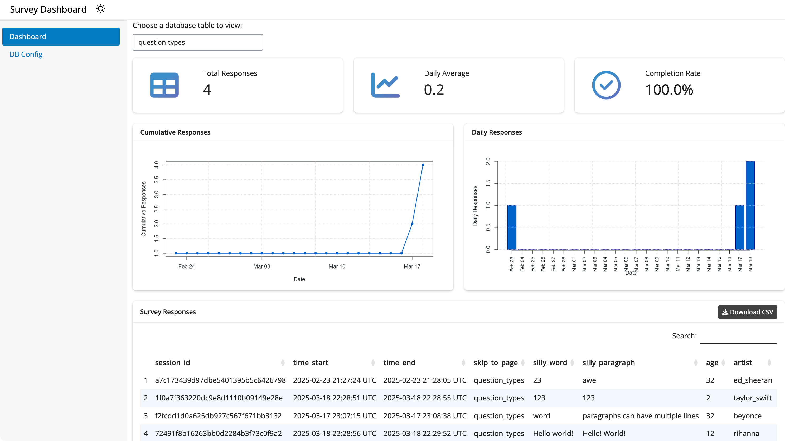

```{r setup, child="../setup.Rmd"}
```

class: center, middle, inverse

.leftcol40[

<center>

</center>

]

.rightcol60[

<br><br>
# .font150[.fancy[`r rmarkdown::metadata$title`]]
 
]

---

```{r child="topics/0.Rmd"}
```

---

```{r child="topics/1.Rmd"}
```

---

class: center 

.leftcol[

## Data is stored in any PostgreSQL database

<center>

</center>

]

.rightcol[

## We use [Supabase](https://supabase.com/) as a free, open-source option

<center>

</center>

]

---

## Store data in [Supabase](https://supabase.com/)

Steps to connect a database via Supabase:

1. Create a Supabase account
2. Create a Supabase project
3. Copy your credentials

<br>

## Full details on the [Storing Data docs page](https://surveydown.org/docs/storing-data)

---

## Creating a project

.leftcol60[

<center>

</center>

]

.rightcol40[

- Choose a project name (this is your "database")
- Each database can have multiple tables
- Choose a strong password

]

---

## Getting your Supabase credentials

.leftcol[

Click the "connect" button in your project

<center>

</center>

]

.rightcol[

Find the “Transaction pooler”  section

<center>

</center>

]

---

## Store your database credentials

.leftcol[

In your R console, run:

```{r}
#| eval: false

surveydown::sd_db_config()
```

<br>

Credentials are stored in a `.env` file in your root project folder.

]

.rightcol[

<center>

</center>

]

---

.leftcol[

# .center[app.R]

.code70[

```{r}
#| eval: false

library(surveydown)

# Connects to database
db <- sd_db_connect() #<<

# Main UI
ui <- sd_ui()

server <- function(input, output, session) {
  # Main server
  sd_server(db)
}

shiny::shinyApp(
  ui = ui, 
  server = server
)
```

]]

.rightcol[

<br><br><br><br>

The `sd_db_connect()` function uses the `.env` file to make the database connection. 
]

---

class: center

## Use `sdApps::sd_dashboard()` to locally view data

<center>

</center>

---

class: inverse

```{r, echo=FALSE}
countdown(
  minutes   = 10,
  top       = 0,
  right     = 0,
  font_size = '2em'
)
```

## Your turn

- Create a Supabase account and database. 
- Run `surveydown::sd_db_config()` in your console to store your Supabase credentials. 
- Run your survey locally, answer questions to generate data.
- View your response data with `sdApps::sd_dashboard()`

---

```{r child="topics/2.Rmd"}
```

---

# Static Data Fetching

Once your database is properly set up, you can fetch the data using:

```{r}
#| eval: false

db <- sd_db_connect()
data <- sd_get_data(db)
```

Or simply:

```{r}
#| eval: false

data <- sd_get_data(sd_db_connect())
```
 
---

## Reactive Data Fetching

You can also reactively fetch the data live inside the survey

In `app.R`:

.leftcol60[

```{r}
#| eval: false

db <- sd_db_connect()

server <- function(input, output, session) {

  data <- sd_get_data(db, refresh_interval = 5) #<<

  sd_server()

}
```

]

---

## Reactive Data Fetching

Use the reactive data to create some output

.leftcol55[

In `app.R`:

```{r}
#| eval: false

server <- function(input, output, session) {

  data <- sd_get_data(db, refresh_interval = 5)

  output$my_plot <- renderPlot({  
    my_data <- data() #<<
    
    # insert code here to make a plot 
    
  })

  sd_server()

}
```

]

.rightcol45[

In `survey.qmd`:

````{markdown}
```{r}
plotOutput("my_plot")
```
````

]

---

class: inverse

```{r, echo=FALSE}
countdown(
  minutes   = 10,
  top       = 0,
  right     = 0,
  font_size = '2em'
)
```

## Your turn

- Use `sd_get_data(db)` to read in a copy of your survey response data.
- Edit your `app.R` file to reactively access your survey data.
- Use your data to make a plot about your data.
- Display your plot in your `survey.qmd` file with `plotOutput("my_plot")`
