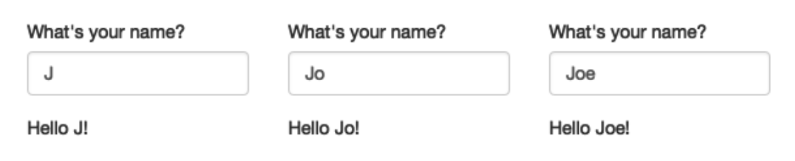

```{r setup, child="../setup.Rmd"}
```

---

class: center, middle

## Read the [chapter](https://mastering-shiny.org/basic-reactivity.html) in Mastering Shiny to<br>understand reactivity in general

<br>

## Read the surveydown [reactivity page](https://surveydown.org/docs/reactivity)<br>for reactivity in surveydown

---

```{r child="topics/0.Rmd"}
```

---

```{r child="topics/1.Rmd"}
```

---

class: center, middle, inverse

# Reactivity is about changing<br>something based on respondent input

---

class: middle, center
background-color: #fff

<center>

</center>

---

## Same example in surveydown

.leftcol45[

In `survey.qmd`:

````{markdown}
```{r}
sd_question(
  type  = "text",
  id    = "name",
  label = "What is your name?"
)

textOutput("greeting") #<<
```
````

]

.rightcol55[

In `app.R`:

```{r}
#| eval: false

server <- function(input, output, session) {

  output$greeting <- renderText({ #<<
    paste0("Hello ", input$name, "!") #<<
  }) #<<

  sd_server()

}
```

]

---

## Simplified with `sd_output()` to display question values

.leftcol60[

In `survey.qmd`:

````{markdown}
```{r}
sd_question(
  type  = "text",
  id    = "name",
  label = "What is your name?"
)
```

Hello, `r sd_output(id = "name", type = "value")`! #<<
````

]

.rightcol40[

In `app.R`:

```{r}
#| eval: false

server <- function(input, output, session) {

  sd_server()

}
```

]

---

## Understanding `sd_output()`

.leftcol[

Question in `survey.qmd`:

````{markdown}
```{r}
sd_question(
  type  = "mc",
  id    = "penguins",
  label = "What's your favorite penguin?",
  option = c(
    "Adélie"    = "adelie", #<<
    "Chinstrap" = "chinstrap",
    "Gentoo"    = "gentoo"
  )
)
```
````

]

.rightcol[

Display a question _value_:

```{r}
#| eval: false

sd_output("penguins", type = "value")
```

Example: `adelie`

<br>

Display a question _label_:

```{r}
#| eval: false

sd_output("penguins", type = "label_option")
```

Example: `Adélie`

]

---

## Understanding `sd_output()`

.leftcol[

Question in `survey.qmd`:

````{markdown}
```{r}
sd_question(
  type  = "mc",
  id    = "penguins",
  label = "What's your favorite penguin?", #<<
  option = c(
    "Adélie"    = "adelie", 
    "Chinstrap" = "chinstrap",
    "Gentoo"    = "gentoo"
  )
)
```
````

]

.rightcol[

Display a _question label_:

```{r}
#| eval: false

sd_output("penguins", type = "label_question")
```

Example:<br>`What's your favorite penguin?`

]

---

class: inverse

```{r, echo=FALSE}
countdown(
  minutes   = 7,
  top       = 0,
  right     = 0,
  font_size = '2em'
)
```

# Your turn

In your survey, display a question _value_ somewhere with: 

```{markdown}
`r sd_output("id", type = "value")` 
```

<br>

In your survey, display a question _option label_ somewhere with: 

```{markdown}
`r sd_output("id", type = "label_option")` 
```

---

```{r child="topics/2.Rmd"}
```

---

## Change the question text based on respondent choices

.leftcol60[

In `survey.qmd`:

````{markdown}
```{r}
sd_question(
  id     = "pet_type",
  type   = "mc",
  label  = "Which do you prefer, dogs or cats?",
  option = c(
    "Dogs" = "dog", 
    "Cats" = "cat"
  )
)
```
````

]

.rightcol40[

Follow up question:

If `dog`: 

Are you a **dog** owner?

<br>

If `cat`: 

Are you a **cat** owner?

]

---

### **Solution**: Define the entire question in the server

.leftcol75[.code70[

```{r}
#| eval: false

library(glue)

server <- function(input, output, session) {

  observe({
    # Trigger with any change to input$pet_type
    pet_type <- input$pet_type

    # Make the question
    sd_question(
      type   = "mc",
      id     = "pet_owner",
      label  = glue("Are you a {pet_type} owner?"),
      option = c("Yes" = "yes", "No" = "no")
    )
  })
  
  # Only show the pet_owner question if pet_type is answered
  sd_show_if(
    sd_is_answered("pet_type") ~ "pet_owner"
  )
  
  sd_server()
}
```

]]

---

### **Solution**: Define the entire question in the server

.leftcol75[.code70[

```{r}
#| eval: false

library(glue)

server <- function(input, output, session) {

  observe({ #<<
    # Trigger with any change to input$pet_type #<<
    pet_type <- input$pet_type #<<

    # Make the question
    sd_question(
      type   = "mc",
      id     = "pet_owner",
      label  = glue("Are you a {pet_type} owner?"),
      option = c("Yes" = "yes", "No" = "no")
    )
  })
  
  # Only show the pet_owner question if pet_type is answered
  sd_show_if(
    sd_is_answered("pet_type") ~ "pet_owner"
  )

  sd_server()
}
```

]]

.rightcol25[

<br>

Use `observe` to detect any change to `pet_type` question

]

---

### **Solution**: Define the entire question in the server

.leftcol75[.code70[

```{r}
#| eval: false

library(glue)

server <- function(input, output, session) {

  observe({
    # Trigger with any change to input$pet_type
    pet_type <- input$pet_type

    # Make the question
    sd_question( #<<
      type   = "mc", #<<
      id     = "pet_owner", #<<
      label  = glue("Are you a {pet_type} owner?"), #<<
      option = c("Yes" = "yes", "No" = "no") #<< 
    ) #<<
  })
  
  # Only show the pet_owner question if pet_type is answered
  sd_show_if(
    sd_is_answered("pet_type") ~ "pet_owner"
  )

  sd_server()
}
```

]]

.rightcol25[

<br><br><br><br><br>

Use `sd_question` to define the question

]

---

### **Solution**: Define the entire question in the server

.leftcol75[.code70[

```{r}
#| eval: false

library(glue)

server <- function(input, output, session) {

  observe({
    # Trigger with any change to input$pet_type
    pet_type <- input$pet_type

    # Make the question
    sd_question(
      type   = "mc",
      id     = "pet_owner", 
      label  = glue("Are you a {pet_type} owner?"), 
      option = c("Yes" = "yes", "No" = "no") 
    )
  })
  
  # Only show the pet_owner question if pet_type is answered
  sd_show_if( #<<
    sd_is_answered("pet_type") ~ "pet_owner" #<<
  ) #<<

  sd_server()
}
```

]]

.rightcol25[

<br><br><br><br><br><br><br><br><br><br>

Hide the `pet_owner` question until the `pet_type` is answered

]

---

## Use `sd_output()` to display the reactive question

.leftcol60[

In `survey.qmd`:

````{markdown}
```{r}
sd_question(
  id     = "pet_type",
  type   = "mc",
  label  = "Which do you prefer, dogs or cats?",
  option = c(
    "Dogs" = "dog", 
    "Cats" = "cat"
  )
)

sd_output("pet_owner", type = "question") #<<
```
````

]

.rightcol40[

Follow up question:

If `dog`: 

Are you a **dog** owner?

<br>

If `cat`: 

Are you a **cat** owner?

]

---

class: inverse

```{r, echo=FALSE}
countdown(
  minutes   = 10,
  top       = 0,
  right     = 0,
  font_size = '2em'
)
```

## Your turn

.leftcol70[

Define a question inside your server (`app.R` file):

```{r}
#| eval: false

server <- function(input, output, session) {

  observe({
    sd_question( 
      type = "mc",
      id   = "id", 
      ...
    ) 
  })

  sd_server()
}
```

Display the question inside your survey (`survey.qmd` file):

```{r}
#| eval: false

sd_output("id", type = "question")
```

]
